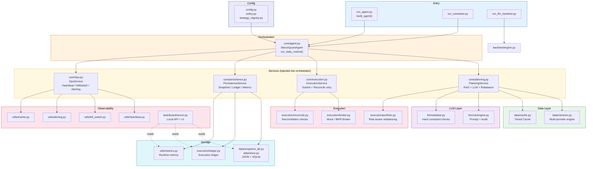
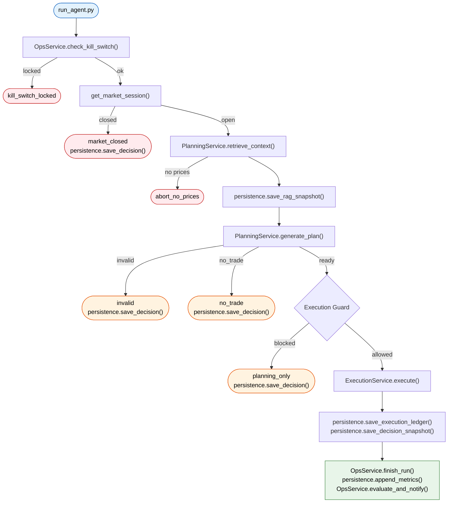

[简体中文](./README.md) | English

# Macro Quant Agent

An LLM-driven macro/tech-stock allocation system built in Python, featuring retrieval-augmented context, portfolio risk constraints, backtesting, scheduling/heartbeat monitoring, and a local Dashboard for audit and replay.

## At a Glance

- LLM-driven daily allocation plans over a fixed tech-stock universe
- An integrated, auditable pipeline: retrieval → validation → order → reconciliation → review
- Safe-by-default execution: `mock` mode, `planning_only` preview, kill switch, market-hours guards
- Backtesting, runtime heartbeat, alerting, and a local Dashboard for replay and operational visibility

## Dashboard Preview

### Main Dashboard (Investor View)

Displays equity curves, holdings, strategy logic, news summaries, order results, and daily reviews:


### Monitor Page (Developer View)

Displays LLM audit trails, execution details, reconciliation, provider health, alerts, and runtime status:


### Core Interactions

- Configure API Keys (DeepSeek / Alpha Vantage / AnySearch) via the sidebar — no manual `.env` editing needed
- News cards auto-invoke the LLM to generate daily summaries, with raw data expandable for review
- Click the `Monitor` link in the top bar to switch to the developer monitoring page

## Why This Project

Most LLM + trading demos stop at "generate a JSON allocation." This project goes further, tackling harder engineering questions:

- How should LLM plans be validated before reaching the execution layer?
- How can a trading workflow be made auditable and replayable?
- What risk constraints should a research system enforce?
- How should strategy logic be separated from execution, scheduling, and operations?

The result is a modular quantitative research system that combines:

- LLM-based daily portfolio planning
- RAG-style context assembly (news, macro, fundamentals, market data)
- Hard portfolio/risk constraints before execution
- Mock and IBKR broker adapters
- Vectorized backtesting with confidence summaries
- Runtime heartbeat, kill switch, alerting, and a local Dashboard

## What It Can Do

### 1. Daily LLM Allocation Planning

The agent retrieves macro, news, fundamentals, market, and SEC EDGAR filing context, then asks the LLM to generate portfolio weights over a fixed tech-stock universe.

### 2. Pre-Execution Risk Constraints

Before converting LLM output into orders, the system validates and sanitizes:

- Per-stock position cap
- Minimum cash buffer
- Dead-zone filter
- Maximum number of holdings
- Top-3 concentration cap
- Theme/risk-group exposure cap
- Maximum daily turnover scaling

### 3. Safe Execution Modes

- `MockBroker` for local simulation with state persistence
- `IBKRBroker` for TWS / Gateway connections
- Unless live trading is explicitly enabled, the system only generates `planning_only` decisions — no orders are placed

### 4. Backtesting and Research Reports

The backtesting module replays LLM plans over historical windows, producing:

- NAV / benchmark charts
- Sharpe and max-drawdown summaries
- Confidence notes on snapshot coverage and synthetic price fallbacks

### 5. Operational Visibility

The project includes a lightweight ops console:

- **Main Dashboard** (`/`): Investor view — equity curves, holdings, strategy logic, news summaries, order results, daily reviews
- **Monitor Page** (`/monitor`): Developer view — LLM audit trails, execution details, reconciliation JSON, provider health, alerts, runtime status
- Heartbeat files, scheduler status, kill switch status, alerts, and event logs

### 6. Frontend Configuration

- Fill in API Keys (DeepSeek / Alpha Vantage / AnySearch) directly in the sidebar — saved to `.env` with no manual file editing
- News cards auto-invoke the LLM to generate daily summaries (cached to `snapshots/news_summary_*.json`), with raw data expandable for review
- Both pages share the same backend, with data synced in real time

## Architecture

```text
.
├── config.py / policy.py / strategy_registry.py     # Config Layer
├── core/
│   ├── agent.py              # Orchestration (injects 4 services)
│   ├── planning.py           # PlanningService — RAG + LLM + Rebalance
│   ├── execution.py          # ExecutionService — Broker + Reconcile
│   ├── persistence.py        # PersistenceService — Snapshot/Ledger/Metrics
│   └── ops.py                # OpsService — Heartbeat/KillSwitch/Alerting
├── data/
│   ├── retriever.py           # Multi-provider data retrieval engine
│   ├── cache.py               # Local cache and mock state
│   ├── snapshot_db.py         # JSON/SQLite dual-write snapshots
│   ├── store.py               # SqliteStore unified storage
│   ├── earnings_agent.py      # Earnings event summaries
│   └── ibkr_data.py           # IBKR live market data helpers
├── llm/
│   ├── volcengine.py          # LLM client + audit + repair loop
│   └── validator.py           # Output validation / sanitization / constraints
├── execution/
│   ├── portfolio.py           # Target weights → orders (with risk constraints)
│   ├── broker.py              # BaseBroker / MockBroker / IBKRBroker
│   ├── ledger.py              # Execution ledger
│   └── reconcile.py           # Reconciliation checks
├── legacy/
│   └── agent.py               # LEGACY — old MacroQuantAgent (kept for reference)
├── backtest/
│   └── engine.py               # Vectorized backtesting engine
├── dashboard/
│   ├── server.py               # Local HTTP API + Settings API + News Summary API
│   └── static/                 # Frontend UI
│       ├── index.html          # Main Dashboard (investor view)
│       ├── monitor.html        # Monitor page (developer view)
│       ├── app.js              # Main Dashboard logic
│       ├── monitor.js          # Monitor page logic
│       └── styles.css          # Shared styles
├── utils/                      # Ops and observability
│   ├── heartbeat.py / kill_switch.py / alerting.py
│   ├── metrics.py / review.py / trading_hours.py
│   ├── run_lock.py / events.py / file_rotate.py
│   └── structlog.py / retry.py / webhook.py
├── run_agent.py                # Production entrypoint (builds all Services then calls agent)
├── run_llm_backtest.py         # Backtesting entrypoint
└── run_scheduler.py            # Lightweight scheduled runner
```

### Layered Architecture



### Daily Routine Pipeline



## Tech Stack

- Python 3.9+
- `pandas`, `numpy`, `matplotlib`
- `openai` SDK, compatible with DeepSeek and Volcengine OpenAI-compatible endpoints
- `yfinance`, `Alpha Vantage`
- SEC EDGAR official filing metadata (8-K, 10-Q, 10-K)
- `ib_insync` for IBKR integration
- `FRED` macroeconomic indicators
- `sqlite3` for structured data persistence (snapshots, ledgers, metrics)
- Local JSON / JSONL persistence for Dashboard consumption

## Quick Start

### 1. Install Dependencies

```bash
pip install -r requirements.txt
```

### 2. Launch Dashboard and Configure API Keys in the Sidebar

```bash
python3 dashboard/server.py
```

Open `http://127.0.0.1:8010`, click the menu button in the top-left corner, and fill in:

- **DeepSeek API Key** (required, for LLM strategy generation and news summaries)
- **Alpha Vantage Key** (optional, improves fundamental data quality)
- **AnySearch Key** (optional, enhances news retrieval)

Click Save to write them to `.env` — no manual file editing needed.

Alternatively, create a `.env` file directly:

```env
DEEPSEEK_API_KEY=your_deepseek_api_key_here
DEEPSEEK_MODEL=deepseek-chat
DEEPSEEK_BASE_URL=https://api.deepseek.com

LLM_PROVIDER=deepseek
LLM_THINKING_TYPE=enabled
LLM_REASONING_EFFORT=high

ALPHA_VANTAGE_KEY=your_alpha_vantage_key_here

BROKER_TYPE=mock
ENABLE_LIVE_TRADING=false

MARKET_TIMEZONE=America/New_York
SEC_EDGAR_USER_AGENT=isolation-research/0.1 contact@example.com

AGENT_SCHEDULER_ENABLED=false
AGENT_SCHEDULE_TIME=16:10
AGENT_SCHEDULE_TIMEZONE=America/New_York
AGENT_SCHEDULE_POLL_SECONDS=30
AGENT_RUN_LOCK_STALE_SECONDS=21600

DASHBOARD_TOKEN=
ALERT_WEBHOOK_URL=
```

### 3. Run Tests

```bash
python3 -m pytest -q
```

### 4. Run the Daily Agent

```bash
python3 run_agent.py
```

### 5. Run Backtesting

```bash
python3 run_llm_backtest.py
```

### 6. Run the Scheduler

```env
AGENT_SCHEDULER_ENABLED=true
AGENT_SCHEDULE_TIME=16:10
AGENT_SCHEDULE_TIMEZONE=America/New_York
```

```bash
python3 run_scheduler.py
```

## Safety Model

This project is conservative by design:

- Default broker mode is `mock`
- Live trading requires explicitly setting `ENABLE_LIVE_TRADING=true`
- LLM output is validated and sanitized before execution
- Invalid output triggers degradation / trade skipping rather than blind submission
- A kill switch can lock the system after critical runtime failures
- Plans continue to be generated even when execution is blocked by market-hours or runtime guards

## Current Limitations

This project has moved beyond toy level, but is still not a production-grade trading platform.

- Some data sources are sensitive to rate limiting, especially `yfinance`
- Backtest confidence depends on point-in-time snapshot coverage
- Synthetic price fallbacks are suitable for demos, but not strong evidence of strategy validity
- Persistence is migrating from files to SQLite; JSON files are retained as a Dashboard compatibility layer
- The Dashboard is designed for local-first, single-user inspection — not multi-user deployment

## Project Highlights

| Dimension | Coverage |
|---|---|
| **Planning** | Daily LLM allocation over a fixed tech-stock universe, grounded in macro/news/fundamentals/market context |
| **Risk Control** | Per-stock caps, dead-zone filter, max holdings, concentration limits, theme risk-group exposure, max daily turnover |
| **Execution** | Dual broker adapters (Mock + IBKR), `planning_only` preview, market-hours awareness |
| **Review** | Auto-briefing, LLM review, evidence weighting, retrieval routing traceability, self-assessment, multi-day comparison |
| **Audit** | Decision snapshots, daily reports, review attachments, execution ledgers, heartbeat events — all locally replayable |
| **Operations** | Scheduler, kill switch, heartbeat/alerting, provider health tracking, runtime event logs |
| **Dashboard** | Dual-page design: Main Dashboard (investor) + Monitor (developer), sidebar API Key configuration, LLM news summaries |
| **Backtesting** | Vectorized LLM plan replay, NAV/benchmark charts, Sharpe/max drawdown, confidence summaries |
| **Safety** | Default `mock`, explicit `ENABLE_LIVE_TRADING`, kill switch lockout, RTH guards, validator repair/degradation paths |
| **Testing** | Regression suite covering portfolio rules, Dashboard auth, runtime guards, review logic, scheduler, reconciliation, report generation |

## 2-Minute Demo

```bash
# 1. Run unit tests (no external services needed)
python3 -m pytest -q

# 2. Run a safe planning-only loop (mock broker + DeepSeek LLM)
python3 run_agent.py

# 3. Launch the Dashboard
python3 dashboard/server.py &
open http://127.0.0.1:8010
# Main Dashboard shows equity curves, holdings, strategy, news summaries, orders, reviews
# Click Monitor in the top bar to enter the developer monitoring page
# Click the menu in the top-left corner to configure API Keys in the sidebar
```

## Main Entrypoints

- `python3 run_agent.py`
- `python3 run_llm_backtest.py`
- `python3 run_scheduler.py`
- `python3 dashboard/server.py`

The `legacy/` directory is kept only for early experiments and is not part of the current production path.

## Project Status

The core pipeline (RAG → LLM plan → portfolio risk control → broker execution → reconciliation → Dashboard) is fully functional and verified with IBKR paper trading on TWS.

### Completed Improvements

| Area | Summary |
|---|---|
| Architecture | 283-line monolithic `run_daily_routine()` decomposed into 4 injectable Service classes (Planning, Execution, Persistence, Ops) |
| Data Layer | Generic `_fetch_with_providers()` engine, WebSearch news source replacing Alpha Vantage |
| Type Safety | Key planning, execution, and validation modules are mypy clean |
| Persistence | SQLite via `data/store.py`, JSON/JSONL retained for Dashboard reads |
| Attribution | `portfolio_attribution` field and highlight extraction |
| Error Handling | All Service methods return `{"success": bool, "status": "...", ...}` |
| Dashboard Tests | 17 API integration tests + 7 Playwright e2e tests |
| Configuration | `config.py` split into `config/secrets.py`, `risk.py`, `broker.py` |
| Broker | IBKR TWS paper trading verified (3 market orders, full reconciliation) |
| Frontend | Dual-page design (investor Dashboard + developer Monitor), sidebar API Key configuration, LLM news summaries |

### Deliberately Not Pursued

| Direction | Reason |
|---|---|
| Multi-strategy integration | The LLM already fuses multiple logic patterns in a single inference; hardcoded strategy templates reduce flexibility |
| Vector RAG | Semantic retrieval suits Q&A, not quantitative workflows that depend on structured facts and real-time prices |
| Production scheduler (APScheduler) | Lightweight polling suffices for mock mode; under IBKR mode, TWS's own scheduling can substitute |

## CI and Code Quality

Uses `ruff` for linting and `pytest` for testing, run via GitHub Actions on every push to `main` and on PRs.

```bash
python3 -m ruff check .        # lint
python3 -m pytest -q            # run all tests
```

## Audit Example

Audited `decision_YYYY-MM-DD.json` plans carry evidence traceability:

```json
{
  "evidence": [
    {
      "source": "news",
      "ticker": "AAPL",
      "quote": "Management reiterated AI device demand remained resilient.",
      "chunk_id": "news:AAPL:2026-05-14:0",
      "url": "https://example.com/research/apple-ai-demand",
      "timestamp": "2026-05-14T13:30:00Z"
    }
  ]
}
```

## Disclaimer

This project is for engineering exploration, research, and technical demonstration only. It does not constitute investment advice. Any LLM-generated allocations should be treated as experimental output, not investment recommendations.

## License

MIT. See `LICENSE`.
