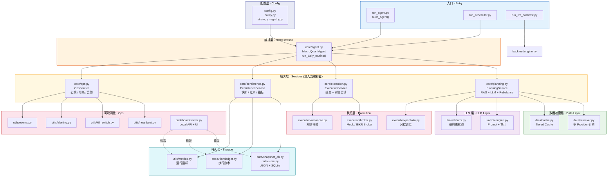

# Macro Quant Agent

[English](./README.md) | [简体中文](./README.zh-CN.md)

LLM-driven macro/tech equity allocation system built with Python, featuring retrieval-augmented context, portfolio risk controls, backtesting, scheduler/heartbeat monitoring, and a local dashboard for audit and replay.

## At A Glance

- LLM-driven daily allocation planning over a fixed tech-stock universe
- Retrieval, validation, order generation, reconciliation, and review in one auditable pipeline
- Safe-by-default execution with `mock`, `planning_only`, kill switch, and market-session guards
- Backtesting, runtime heartbeat, alerting, and a bilingual local dashboard for replay and operator visibility

## Demo

### Dashboard Snapshot

English dashboard:


Chinese dashboard:


### Showcase Features

- Review panel with `Auto Brief`, `LLM Review`, evidence weights, retrieval route, and self-evaluation
- `planning_only` preview path that shows what would have been submitted without placing live orders
- Multi-day compare view for strategy, cognitive-layer, and position deltas
- Bilingual UI toggle for Chinese / English demos

## Project Status

- Research preview, not production trading software
- Safe by default: `BROKER_TYPE=mock` and live order submission requires explicit opt-in
- Focused on engineering reliability, risk controls, auditability, and operator visibility

## Why This Project Exists

Most LLM + trading demos stop at "generate a JSON allocation". This project goes further and tries to answer harder engineering questions:

- How should an LLM plan be validated before it reaches execution?
- How do you keep a trading workflow auditable and replayable?
- What risk controls should exist even in a research system?
- How do you separate strategy logic from execution, scheduling, and runtime operations?

The result is a modular quant research system that combines:

- LLM-based daily portfolio planning
- RAG-style context assembly from news, macro, fundamentals, and market data
- Hard portfolio/risk constraints before execution
- Mock and IBKR broker adapters
- Vectorized backtesting with credibility summary
- Runtime heartbeat, kill switch, alerting, and a local dashboard

## Why It Is Portfolio-Worthy

Many internship-level trading demos stop at prompt engineering. This repo is stronger as a systems project because it demonstrates:

- separation between planning, execution, review, and operations layers
- explicit runtime and broker guardrails instead of "LLM decides and submits"
- replayable local artifacts for decisions, reports, metrics, alerts, and snapshots
- a presentable dashboard surface rather than terminal-only output
- targeted regression coverage around runtime guards, review logic, and dashboard behavior

## What It Can Do

### 1. Daily LLM allocation planning

The agent retrieves macro, news, fundamental, market, and SEC EDGAR filing context, then asks the LLM to produce portfolio weights over a fixed tech universe.

### 2. Guardrails before any execution

The system validates and cleans LLM output before turning it into orders:

- single-name cap
- minimum cash buffer
- deadband filtering
- max holdings
- top-3 concentration cap
- thematic/risk-group exposure caps
- max daily turnover scaling

### 3. Safe execution modes

- `MockBroker` supports local simulation and state persistence
- `IBKRBroker` supports TWS / Gateway connectivity
- when live trading is not explicitly enabled, the system only generates a `planning_only` decision and does not place orders

### 4. Backtest and research reporting

The backtest module can replay LLM plans over historical windows and generates:

- NAV / benchmark chart
- Sharpe and max drawdown summary
- credibility notes about snapshot coverage and synthetic-price fallback

### 5. Runtime operations visibility

The project includes a lightweight operator console:

- local dashboard for strategy / execution / alerts / logs / equity curve
- heartbeat file for recent run status
- scheduler state
- structured kill-switch state
- alert and event logs for troubleshooting

## Architecture

```text
.
├── config.py / policy.py / strategy_registry.py     # 配置层 · Config
├── core/
│   ├── agent.py              # 编排器 · Orchestration (injects 4 services)
│   ├── planning.py           # PlanningService — RAG + LLM + Rebalance
│   ├── execution.py          # ExecutionService — Broker + Reconcile
│   ├── persistence.py        # PersistenceService — Snapshot/Ledger/Metrics
│   └── ops.py                # OpsService — Heartbeat/KillSwitch/Alerting
├── data/
│   ├── retriever.py           # 多 Provider 数据检索引擎
│   ├── cache.py               # 本地缓存与模拟状态
│   ├── snapshot_db.py         # JSON/SQLite 双写快照
│   ├── store.py               # SqliteStore 统一存储
│   ├── earnings_agent.py      # 盈利事件摘要
│   └── ibkr_data.py           # IBKR 实时行情辅助
├── llm/
│   ├── volcengine.py          # LLM 客户端 + 审计 + 修复循环
│   └── validator.py           # 输出校验 / 清洗 / 约束
├── execution/
│   ├── portfolio.py           # 目标权重 → 订单 (含风控约束)
│   ├── broker.py              # BaseBroker / MockBroker / IBKRBroker
│   ├── ledger.py              # 执行账本
│   └── reconcile.py           # 对账校验
├── legacy/
│   └── agent.py               # LEGACY — 旧版 MacroQuantAgent (保留参考)
├── backtest/
│   └── engine.py               # 向量化回测引擎
├── dashboard/
│   ├── server.py               # 本地 HTTP API
│   └── static/                 # 前端 UI
├── utils/                      # 运维与可观测性
│   ├── heartbeat.py / kill_switch.py / alerting.py
│   ├── metrics.py / review.py / trading_hours.py
│   ├── run_lock.py / events.py / file_rotate.py
│   └── structlog.py / retry.py / webhook.py
├── run_agent.py                # 生产入口 (构建所有 Service 后调用 agent)
├── run_llm_backtest.py         # 回测入口
└── run_scheduler.py            # 轻量定时调度
```

### Layered Architecture (Refactored)



### Daily Routine Pipeline (v2 — via Services)


## Tech Stack

- Python 3.9+
- `pandas`, `numpy`, `matplotlib`
- `openai` SDK for OpenAI-compatible providers such as DeepSeek and Volcengine-compatible endpoints
- `yfinance`, `Alpha Vantage`
- SEC EDGAR for official filing metadata (8-K, 10-Q, 10-K)
- `ib_insync` for IBKR integration
- `FRED` for macroeconomic indicators
- `sqlite3` for structured data persistence (snapshots, ledger, metrics)
- local JSON / JSONL persistence for dashboard-readable artifacts and runtime state

## Quick Start

### 1. Install dependencies

```bash
pip install -r requirements.txt
```

### 2. Create `.env`

```env
ALPHA_VANTAGE_KEY=your_alpha_vantage_key_here

DEEPSEEK_API_KEY=your_deepseek_api_key_here
DEEPSEEK_MODEL=deepseek-v4-pro
DEEPSEEK_BASE_URL=https://api.deepseek.com

LLM_PROVIDER=deepseek
LLM_THINKING_TYPE=enabled
LLM_REASONING_EFFORT=high

MARKET_TIMEZONE=America/New_York

IBKR_HOST=127.0.0.1
IBKR_PORT=7497
IBKR_CLIENT_ID=1
IBKR_DATA_CLIENT_ID=11

BROKER_TYPE=mock
ENABLE_LIVE_TRADING=false

SEC_EDGAR_USER_AGENT=isolation-research/0.1 contact@example.com

AGENT_SCHEDULER_ENABLED=false
AGENT_SCHEDULE_TIME=16:10
AGENT_SCHEDULE_TIMEZONE=America/New_York
AGENT_SCHEDULE_POLL_SECONDS=30
AGENT_RUN_LOCK_STALE_SECONDS=21600

DASHBOARD_TOKEN=
ALERT_WEBHOOK_URL=
```

Legacy `VOLCENGINE_*` variables are still supported for compatibility, but the current recommended demo path uses DeepSeek's official OpenAI-compatible endpoint.

### 3. Run tests

```bash
python3 -m pytest -q
```

### 4. Run the daily agent

```bash
python3 run_agent.py
```

### 5. Run the backtest

```bash
python3 run_llm_backtest.py
```

### 6. Run the dashboard

```bash
python3 dashboard/server.py
```

Default address:

```text
http://127.0.0.1:8010/
```

### 7. Run the scheduler

```env
AGENT_SCHEDULER_ENABLED=true
AGENT_SCHEDULE_TIME=16:10
AGENT_SCHEDULE_TIMEZONE=America/New_York
AGENT_SCHEDULE_POLL_SECONDS=30
```

```bash
python3 run_scheduler.py
```

## Safety Model

This repo is intentionally conservative:

- default broker mode is `mock`
- `ENABLE_LIVE_TRADING=true` is required before real IBKR submission
- LLM output is validated and cleaned before execution
- invalid output causes downgrade / skip-trade behavior instead of blind submission
- kill switch can lock the system after serious runtime failures
- planning can proceed even when execution is blocked by market session or runtime guardrails

## Current Limitations

This project is more than a toy, but it is still not a production-grade trading platform.

- some data sources are rate-limit sensitive, especially `yfinance`
- backtest credibility depends on point-in-time snapshot coverage
- synthetic-price fallback is useful for demos but not strong evidence of strategy validity
- persistence is transitioning from file-based to SQLite-backed; JSON files remain as a compatibility layer for the dashboard
- dashboard is local-first and designed for inspection, not multi-user deployment

## Project Highlights

| Dimension | What It Covers |
|---|---|
| **Planning** | Daily LLM allocation over a fixed tech universe, evidence-grounded with macro/news/fundamental/market context |
| **Guardrails** | Single-name cap, deadband, max holdings, concentration limits, thematic-risk-group exposure caps, max daily turnover |
| **Execution** | Dual broker adapters (Mock + IBKR), `planning_only` preview, market-session awareness |
| **Review** | Auto Brief, LLM Review, evidence weights, retrieval route provenance, self-evaluation, multi-day cognitive comparison |
| **Audit** | Decision snapshots, daily reports, review sidecars, execution ledgers, heartbeat events — all local and replayable |
| **Operations** | Scheduler, kill switch, heartbeat/alerting, provider-health tracking, runtime event log |
| **Dashboard** | Bilingual (中/EN) web UI with replay, compare, cognitive-layer inspection, and would-submit preview |
| **Backtest** | Vectorized LLM-plan replay, NAV/benchmark charts, Sharpe/max-drawdown, credibility summary |
| **Safety** | `mock` by default, `ENABLE_LIVE_TRADING` opt-in, kill-switch locking, RTH guards, validator repair/downgrade path |
| **Testing** | Regression suite covering portfolio rules, dashboard auth, runtime guards, review logic, scheduler, reconciliation, report generation |

## How To Demo In 2 Minutes

Paste these commands for a self-contained walkthrough:

```bash
# 1. Run unit tests (no external services needed)
python3 -m pytest -q

# 2. Run a safe planning-only cycle (mock broker, DeepSeek LLM)
python3 run_agent.py
# Inspect the decision artifact:
#   cat decision_*.json | python3 -m json.tool | head -80

# 3. Generate a daily report with LLM review
python3 reports/generate_daily_report.py
# Inspect the review sidecar:
#   cat reports/daily_report_*.review.json | python3 -m json.tool | head -60

# 4. Launch the dashboard
python3 dashboard/server.py &
open http://127.0.0.1:8010
# The dashboard shows review, auto-brief, evidence weights, and would-submit preview.
# Click "中文 / EN" to switch languages.
```

### Presentation talking points

1. Start with the dashboard screenshots above.
2. Explain the safety model: `mock` by default, `planning_only` unless live trading is explicitly enabled.
3. Walk through `run_agent.py` → `core/agent.py` → `execution/portfolio.py` → dashboard / reports.
4. Open a decision snapshot and show audit metadata plus evidence provenance.
5. Mention the bilingual dashboard for different audiences.

## Main Entrypoints

- `python3 run_agent.py`
- `python3 run_llm_backtest.py`
- `python3 run_scheduler.py`
- `python3 dashboard/server.py`

The `legacy/` directory only preserves earlier experiments and is not part of the current production path of the project.

## Roadmap

The next upgrades that would most improve the repo are:

- improve data-source reliability and fallback strategy
- strengthen backtest credibility and cost modeling
- strengthen CI, lint, and type-checking coverage
- move from file-based state to SQLite / Postgres
- add real vector-store-backed RAG
- add multi-day dashboard replay and execution-quality analytics
- decompose `MacroQuantAgent` into finer-grained service layers
- introduce multi-strategy integration with voting/weighting across sub-strategies

Detailed internal task tracking is maintained in `TASKS.md`.

## CI and Code Quality

This project uses `ruff` for linting and `pytest` for testing, enforced via GitHub Actions on every push to `main` and on pull requests. The lint rules (configured in `.ruff.toml`) target bug-prone patterns only (unused imports, ambiguous variable names, missing f-string placeholders), deliberately keeping a low-noise baseline suitable for fast research iteration.

```bash
python3 -m ruff check .        # lint
python3 -m pytest -q            # run all tests
```

## Audit Example

An audited `decision_YYYY-MM-DD.json` plan can now carry evidence provenance like this:

```json
{
  "evidence": [
    {
      "source": "news",
      "ticker": "AAPL",
      "quote": "Management reiterated AI device demand remained resilient.",
      "chunk_id": "news:AAPL:2026-05-14:0",
      "url": "https://example.com/research/apple-ai-demand",
      "timestamp": "2026-05-14T13:30:00Z"
    }
  ]
}
```

This keeps the review path lightweight while still letting the dashboard and snapshots answer where a quote came from, which chunk produced it, and when it was observed.

## Disclaimer

This project is for engineering exploration, research, and technical demonstration only. It does not constitute financial advice, and any LLM-generated allocation should be treated as experimental output rather than an investment recommendation.

## License

MIT. See `LICENSE`.
