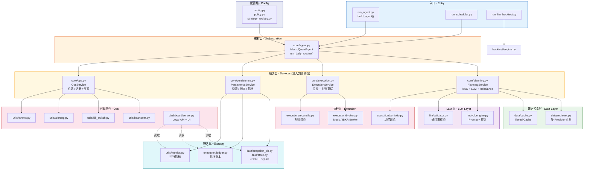
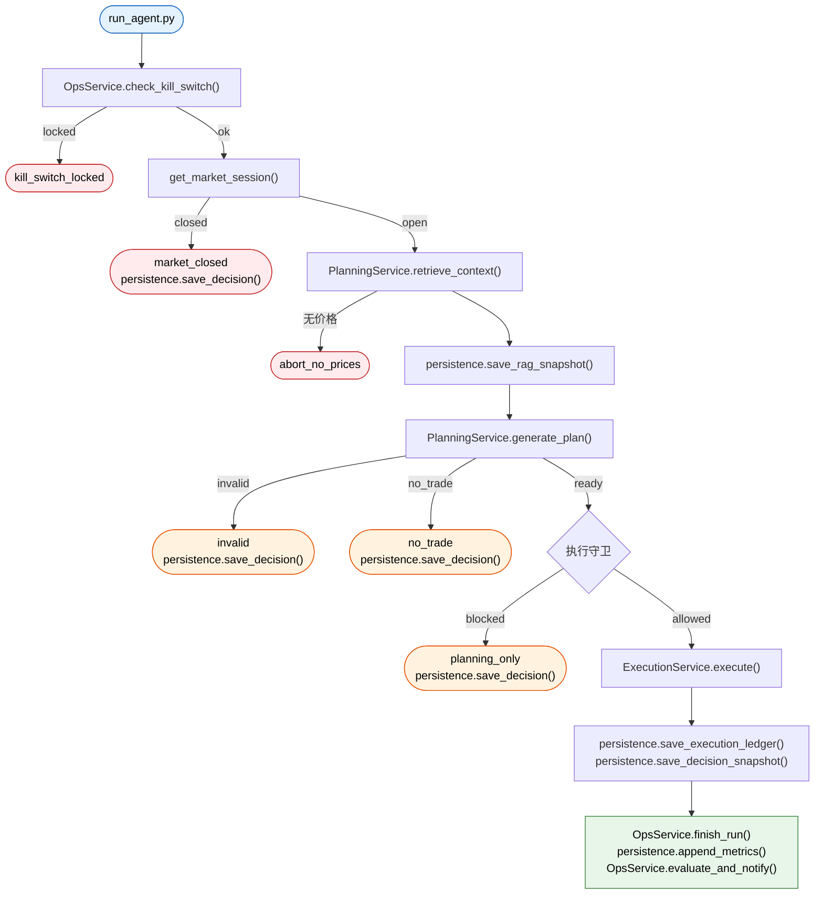

# Macro Quant Agent

[简体中文](./README.md) | [English](./README.en.md)

LLM 驱动的宏观/科技股配置系统，基于 Python 构建，具备检索增强上下文、组合风控约束、回测、调度/心跳监控，以及本地 Dashboard 用于审计与回放。

## 一览

- LLM 驱动的每日配置计划，覆盖固定科技股池
- 检索、验证、下单、对账、复盘一体化可审计流水线
- 安全默认执行：`mock` 模式、`planning_only` 预览、kill switch、市场时段守卫
- 回测、运行时心跳、告警、本地 Dashboard 支持回放与运维可见性

## Dashboard 预览

### 主 Dashboard（投资者视角）

展示权益曲线、持仓、策略逻辑、新闻摘要、订单结果、每日复盘：


### Monitor 页面（开发者视角）

展示 LLM 审计轨迹、执行明细、对账、Provider 健康、告警、运行时状态：


### 核心交互

- 侧边栏配置 API Key（DeepSeek / Alpha Vantage / AnySearch），无需手动编辑 `.env`
- 新闻卡片自动调用 LLM 生成当日摘要，原始数据可展开查看
- 顶栏 `Monitor` 链接一键切换开发者监测页面

## 项目定位

大多数 LLM + 交易 Demo 止步于"生成一个 JSON 配置"。本项目更进一步，回答更难的工程问题：

- LLM 计划在到达执行层之前应该如何验证？
- 如何让交易工作流可审计、可回放？
- 研究系统应该有哪些风控约束？
- 如何将策略逻辑与执行、调度、运维分离？

结果是一个模块化的量化研究系统，结合了：

- 基于 LLM 的每日组合计划
- RAG 式上下文组装（新闻、宏观、基本面、市场数据）
- 执行前的硬性组合/风控约束
- Mock 和 IBKR Broker 适配器
- 向量化回测，含可信度摘要
- 运行时心跳、kill switch、告警、本地 Dashboard

## 功能概览

### 1. 每日 LLM 配置计划

Agent 检索宏观、新闻、基本面、市场和 SEC EDGAR 公告上下文，然后让 LLM 在固定科技股池上生成组合权重。

### 2. 执行前的风控约束

系统在将 LLM 输出转为订单之前进行验证和清洗：

- 个股上限
- 最低现金缓冲
- 死区过滤
- 最大持仓数
- Top-3 集中度上限
- 主题/风险组敞口上限
- 最大日换手率缩放

### 3. 安全执行模式

- `MockBroker` 支持本地模拟和状态持久化
- `IBKRBroker` 支持 TWS / Gateway 连接
- 未显式启用实盘交易时，系统仅生成 `planning_only` 决策，不下单

### 4. 回测和研究报告

回测模块可在历史窗口上回放 LLM 计划，生成：

- 净值 / 基准图表
- Sharpe 和最大回撤摘要
- 关于快照覆盖率和合成价格回退的可信度说明

### 5. 运维可见性

项目包含轻量级运维控制台：

- **主 Dashboard**（`/`）：投资者视角 — 权益曲线、持仓、策略逻辑、新闻摘要、订单结果、每日复盘
- **Monitor 页面**（`/monitor`）：开发者视角 — LLM 审计轨迹、执行明细、对账 JSON、Provider 健康、告警、运行时状态
- 心跳文件、调度器状态、kill switch 状态、告警和事件日志

### 6. 前端配置

- 侧边栏直接填写 API Key（DeepSeek / Alpha Vantage / AnySearch），保存到 `.env`，无需手动编辑文件
- 新闻卡片自动调用 LLM 生成当日摘要（缓存到 `snapshots/news_summary_*.json`），原始数据可展开查看
- 两个页面共享同一后端，数据实时同步

## 架构

```text
.
├── config.py / policy.py / strategy_registry.py     # 配置层 · Config
├── core/
│   ├── agent.py              # 编排器 · Orchestration (injects 4 services)
│   ├── planning.py           # PlanningService — RAG + LLM + Rebalance
│   ├── execution.py          # ExecutionService — Broker + Reconcile
│   ├── persistence.py        # PersistenceService — Snapshot/Ledger/Metrics
│   └── ops.py                # OpsService — Heartbeat/KillSwitch/Alerting
├── data/
│   ├── retriever.py           # 多 Provider 数据检索引擎
│   ├── cache.py               # 本地缓存与模拟状态
│   ├── snapshot_db.py         # JSON/SQLite 双写快照
│   ├── store.py               # SqliteStore 统一存储
│   ├── earnings_agent.py      # 盈利事件摘要
│   └── ibkr_data.py           # IBKR 实时行情辅助
├── llm/
│   ├── volcengine.py          # LLM 客户端 + 审计 + 修复循环
│   └── validator.py           # 输出校验 / 清洗 / 约束
├── execution/
│   ├── portfolio.py           # 目标权重 → 订单 (含风控约束)
│   ├── broker.py              # BaseBroker / MockBroker / IBKRBroker
│   ├── ledger.py              # 执行账本
│   └── reconcile.py           # 对账校验
├── legacy/
│   └── agent.py               # LEGACY — 旧版 MacroQuantAgent (保留参考)
├── backtest/
│   └── engine.py               # 向量化回测引擎
├── dashboard/
│   ├── server.py               # 本地 HTTP API + Settings API + News Summary API
│   └── static/                 # 前端 UI
│       ├── index.html          # 主 Dashboard（投资者视角）
│       ├── monitor.html        # Monitor 页面（开发者视角）
│       ├── app.js              # 主 Dashboard 逻辑
│       ├── monitor.js          # Monitor 页面逻辑
│       └── styles.css          # 共享样式
├── utils/                      # 运维与可观测性
│   ├── heartbeat.py / kill_switch.py / alerting.py
│   ├── metrics.py / review.py / trading_hours.py
│   ├── run_lock.py / events.py / file_rotate.py
│   └── structlog.py / retry.py / webhook.py
├── run_agent.py                # 生产入口 (构建所有 Service 后调用 agent)
├── run_llm_backtest.py         # 回测入口
└── run_scheduler.py            # 轻量定时调度
```

### 分层架构



### 每日流水线



## 技术栈

- Python 3.9+
- `pandas`, `numpy`, `matplotlib`
- `openai` SDK，兼容 DeepSeek 和火山引擎等 OpenAI 兼容端点
- `yfinance`, `Alpha Vantage`
- SEC EDGAR 官方公告元数据（8-K, 10-Q, 10-K）
- `ib_insync` 用于 IBKR 集成
- `FRED` 宏观经济指标
- `sqlite3` 结构化数据持久化（快照、账本、指标）
- 本地 JSON / JSONL 持久化，供 Dashboard 读取

## 快速开始

### 1. 安装依赖

```bash
pip install -r requirements.txt
```

### 2. 启动 Dashboard 并在侧边栏配置 API Key

```bash
python3 dashboard/server.py
```

打开 `http://127.0.0.1:8010`，点击左上角菜单按钮，在侧边栏填写：

- **DeepSeek API Key**（必填，用于 LLM 策略生成和新闻摘要）
- **Alpha Vantage Key**（可选，提升基本面数据质量）
- **AnySearch Key**（可选，增强新闻检索）

点击 Save 即可保存到 `.env`，无需手动编辑文件。

或者直接创建 `.env`：

```env
DEEPSEEK_API_KEY=your_deepseek_api_key_here
DEEPSEEK_MODEL=deepseek-chat
DEEPSEEK_BASE_URL=https://api.deepseek.com

LLM_PROVIDER=deepseek
LLM_THINKING_TYPE=enabled
LLM_REASONING_EFFORT=high

ALPHA_VANTAGE_KEY=your_alpha_vantage_key_here

BROKER_TYPE=mock
ENABLE_LIVE_TRADING=false

MARKET_TIMEZONE=America/New_York
SEC_EDGAR_USER_AGENT=isolation-research/0.1 contact@example.com

AGENT_SCHEDULER_ENABLED=false
AGENT_SCHEDULE_TIME=16:10
AGENT_SCHEDULE_TIMEZONE=America/New_York
AGENT_SCHEDULE_POLL_SECONDS=30
AGENT_RUN_LOCK_STALE_SECONDS=21600

DASHBOARD_TOKEN=
ALERT_WEBHOOK_URL=
```

### 3. 运行测试

```bash
python3 -m pytest -q
```

### 4. 运行每日 Agent

```bash
python3 run_agent.py
```

### 5. 运行回测

```bash
python3 run_llm_backtest.py
```

### 6. 运行调度器

```env
AGENT_SCHEDULER_ENABLED=true
AGENT_SCHEDULE_TIME=16:10
AGENT_SCHEDULE_TIMEZONE=America/New_York
```

```bash
python3 run_scheduler.py
```

## 安全模型

本项目设计上偏保守：

- 默认 broker 模式为 `mock`
- 实盘交易需显式设置 `ENABLE_LIVE_TRADING=true`
- LLM 输出在执行前经过验证和清洗
- 无效输出触发降级/跳过交易，而非盲目提交
- kill switch 可在严重运行故障后锁定系统
- 即使执行被市场时段或运行时守卫阻止，计划仍可继续生成

## 当前局限

本项目已超越玩具级别，但仍非生产级交易平台。

- 部分数据源对限流敏感，尤其是 `yfinance`
- 回测可信度取决于时点快照覆盖率
- 合成价格回退适用于 Demo，但不是策略有效性的有力证据
- 持久化正在从文件向 SQLite 迁移；JSON 文件作为 Dashboard 兼容层保留
- Dashboard 为本地优先设计，面向单用户检查，非多用户部署

## 项目亮点

| 维度 | 覆盖范围 |
|---|---|
| **计划** | 每日 LLM 配置，覆盖固定科技股池，以宏观/新闻/基本面/市场上下文为证据 |
| **风控** | 个股上限、死区、最大持仓、集中度限制、主题风险组敞口、最大日换手率 |
| **执行** | 双 Broker 适配器（Mock + IBKR）、`planning_only` 预览、市场时段感知 |
| **复盘** | 自动简报、LLM Review、证据权重、检索路由溯源、自评、多日对比 |
| **审计** | 决策快照、日报、复盘附件、执行账本、心跳事件 — 全部本地可回放 |
| **运维** | 调度器、kill switch、心跳/告警、Provider 健康追踪、运行时事件日志 |
| **Dashboard** | 双页面设计：主 Dashboard（投资者）+ Monitor（开发者），侧边栏配置 API Key，LLM 新闻摘要 |
| **回测** | 向量化 LLM 计划回放、净值/基准图表、Sharpe/最大回撤、可信度摘要 |
| **安全** | 默认 `mock`、`ENABLE_LIVE_TRADING` 显式启用、kill switch 锁定、RTH 守卫、验证器修复/降级路径 |
| **测试** | 回归套件覆盖组合规则、Dashboard 认证、运行时守卫、复盘逻辑、调度器、对账、报告生成 |

## 2 分钟 Demo

```bash
# 1. 运行单元测试（无需外部服务）
python3 -m pytest -q

# 2. 运行安全的 planning-only 循环（mock broker + DeepSeek LLM）
python3 run_agent.py

# 3. 启动 Dashboard
python3 dashboard/server.py &
open http://127.0.0.1:8010
# 主 Dashboard 展示权益曲线、持仓、策略、新闻摘要、订单、复盘
# 点击顶栏 Monitor 进入开发者监测页面
# 点击左上角菜单在侧边栏配置 API Key
```

## 主要入口

- `python3 run_agent.py`
- `python3 run_llm_backtest.py`
- `python3 run_scheduler.py`
- `python3 dashboard/server.py`

`legacy/` 目录仅保留早期实验，不属于当前生产路径。

## 项目状态

核心流水线（RAG → LLM 计划 → 组合风控 → Broker 执行 → 对账 → Dashboard）已完全可用，并通过 TWS 上的 IBKR 模拟交易验证。

### 已完成改进

| 领域 | 概要 |
|---|---|
| 架构 | 283 行单体 `run_daily_routine()` 分解为 4 个注入式 Service 类（Planning, Execution, Persistence, Ops） |
| 数据层 | `_fetch_with_providers()` 通用引擎，WebSearch 新闻源替代 Alpha Vantage |
| 类型安全 | 关键 planning、execution、validation 模块 mypy clean |
| 持久化 | SQLite via `data/store.py`，JSON/JSONL 保留供 Dashboard 读取 |
| 归因 | `portfolio_attribution` 字段与亮点提取 |
| 错误处理 | 所有 Service 方法返回 `{"success": bool, "status": "...", ...}` |
| Dashboard 测试 | 17 个 API 集成测试 + 7 个 Playwright e2e 测试 |
| 配置 | `config.py` 拆分为 `config/secrets.py`, `risk.py`, `broker.py` |
| Broker | IBKR TWS 模拟交易验证（3 笔市价单，完整对账） |
| 前端 | 双页面设计（投资者 Dashboard + 开发者 Monitor），侧边栏 API Key 配置，LLM 新闻摘要 |

### 刻意不做的方向

| 方向 | 理由 |
|---|---|
| 多策略集成 | LLM 已在单次推理中融合多种逻辑；硬编码策略模板降低灵活性 |
| 向量 RAG | 语义检索适合 Q&A，不适合依赖结构化事实和实时价格的量化工作流 |
| 生产调度器（APScheduler） | 轻量轮询对 mock 模式足够；IBKR 模式下 TWS 自身调度可替代 |

## CI 与代码质量

使用 `ruff` 进行 lint、`pytest` 进行测试，通过 GitHub Actions 在每次 push 到 `main` 和 PR 时执行。

```bash
python3 -m ruff check .        # lint
python3 -m pytest -q            # 运行所有测试
```

## 审计示例

审计过的 `decision_YYYY-MM-DD.json` 计划可携带证据溯源：

```json
{
  "evidence": [
    {
      "source": "news",
      "ticker": "AAPL",
      "quote": "Management reiterated AI device demand remained resilient.",
      "chunk_id": "news:AAPL:2026-05-14:0",
      "url": "https://example.com/research/apple-ai-demand",
      "timestamp": "2026-05-14T13:30:00Z"
    }
  ]
}
```

## 免责声明

本项目仅供工程探索、研究和技术演示。不构成投资建议，任何 LLM 生成的配置应视为实验输出，而非投资推荐。

## 许可

MIT. See `LICENSE`.
