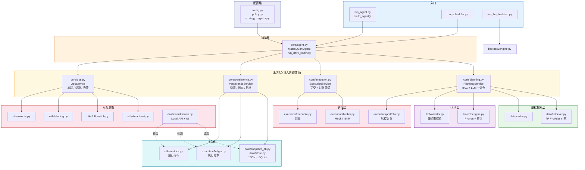
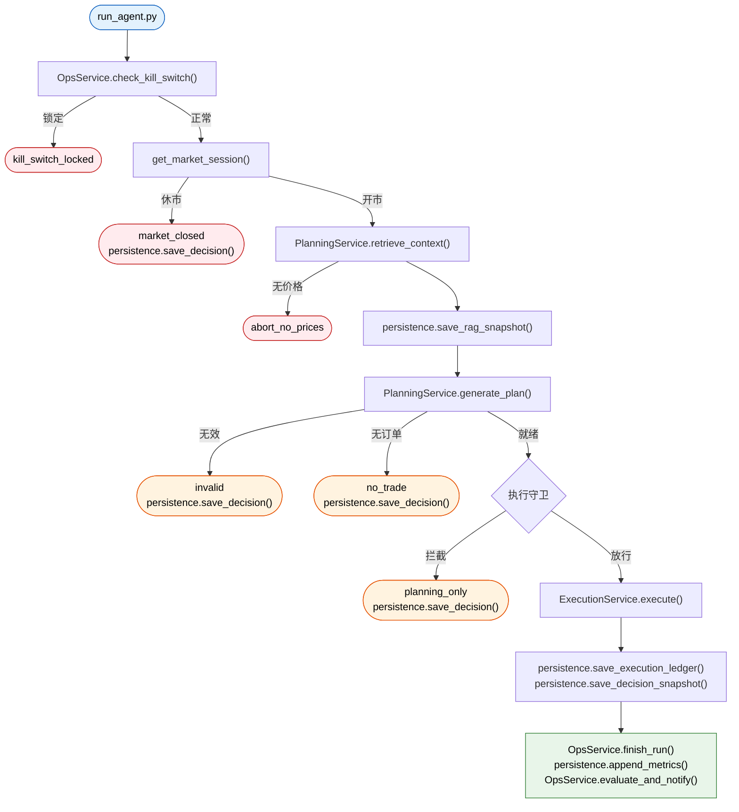

# Macro Quant Agent

[English](./README.md) | [简体中文](./README.zh-CN.md)

一个基于 Python 构建的 LLM 驱动宏观/科技股资产配置研究系统，包含检索增强上下文、组合风控、回测、调度与心跳监控，以及用于审计和复盘的本地 Dashboard。

## 一眼看懂

- 面向固定科技股股票池的日度 LLM 资产配置规划
- 把检索、校验、下单计划、对账和复盘串成一条可审计链路
- 默认安全运行，具备 `mock`、`planning_only`、熔断和交易时段守卫
- 自带回测、运行心跳、告警，以及可中英切换的本地 Dashboard

## 演示效果

### Dashboard 截图

英文界面：


中文界面：


### 当前展示亮点

- 复盘面板已经接入 `Auto Brief`、`LLM Review`、证据权重、检索路由和模型自评
- 支持 `planning_only` 预览链路，能展示“本来会怎么下单”而不真实提交
- 支持多日对比，可展示策略、认知层和仓位变化
- Dashboard 已支持中英文切换，更适合答辩、面试和 GitHub 展示

## 项目状态

- 当前定位为研究预览版，不是生产级交易系统
- 默认安全模式运行：`BROKER_TYPE=mock`
- 真实下单需要显式开启 `ENABLE_LIVE_TRADING=true`
- 重点放在工程可靠性、风控、审计可追踪与运行可观测性

## 这个项目在解决什么问题

很多 “LLM + 交易” Demo 只停留在“让模型输出一份 JSON 持仓权重”。这个项目更关注后面的工程问题：

- LLM 生成的计划，在执行前应该如何校验？
- 一个交易研究系统如何做到可审计、可复盘？
- 即使只是研究型系统，也应该具备哪些风控？
- 如何把策略、执行、调度、运行状态解耦开来？

围绕这些问题，这个仓库实现了：

- 基于 LLM 的日度组合规划
- 从新闻、宏观、基本面、行情组装 RAG 风格上下文
- 执行前的硬性风控与组合约束
- Mock / IBKR 双券商适配
- 向量化回测与可信度摘要
- 心跳、熔断、告警、Dashboard 等运维视角能力

## 为什么适合放进作品集

很多面向实习的量化项目只展示“提示词 + JSON 输出”。这个仓库更像一个完整系统项目，因为它体现了：

- 规划、执行、复盘、运维之间的清晰分层
- 对 broker 和运行时风险的显式保护，而不是让 LLM 直接提交交易
- 决策、报告、指标、告警、快照等本地工件的可回放能力
- 不只是命令行输出，还有可以直接展示的 Dashboard 前端
- 针对运行守卫、复盘链路和 Dashboard 行为的回归测试

## 主要能力

### 1. 日度 LLM 组合规划

系统会拉取宏观、新闻、基本面、市场及 SEC EDGAR 公告数据，然后让 LLM 在固定科技股股票池上生成目标权重。

### 2. 执行前风控

LLM 输出不会直接变成订单，而是先经过校验与清洗，包括：

- 单票持仓上限
- 最低现金缓冲
- 死区过滤
- 最大持仓数
- Top3 集中度上限
- 主题/风险分组暴露上限
- 最大单日换手率缩放

### 3. 安全执行模式

- `MockBroker` 用于本地仿真和状态持久化
- `IBKRBroker` 用于连接 TWS / Gateway
- 未显式开启实盘时，系统只会生成 `planning_only` 结果，不会真实下单

### 4. 回测与研究报告

回测模块支持在历史窗口上回放 LLM 计划，并输出：

- 净值 / 基准对比图
- 夏普率、最大回撤等指标
- 关于快照覆盖率与 synthetic prices 的可信度摘要

### 5. 运行态可观测性

仓库自带一个轻量级本地运维台：

- Dashboard 展示策略、执行、告警、日志和资金曲线
- 心跳文件记录最近运行状态
- 调度器状态
- 结构化 kill switch 状态
- 事件与告警日志，便于排障

## 架构

```text
.
├── config.py / policy.py / strategy_registry.py     # 配置层
├── core/
│   ├── agent.py              # 编排器 (注入 4 个服务)
│   ├── planning.py           # PlanningService — RAG + LLM + 调仓
│   ├── execution.py          # ExecutionService — Broker + 对账
│   ├── persistence.py        # PersistenceService — 快照/账本/指标
│   └── ops.py                # OpsService — 心跳/熔断/告警
├── data/
│   ├── retriever.py           # 多 Provider 数据检索
│   ├── cache.py               # 本地缓存与模拟状态
│   ├── snapshot_db.py         # JSON/SQLite 双写快照
│   ├── store.py               # SqliteStore 统一存储
│   ├── earnings_agent.py      # 盈利事件摘要
│   └── ibkr_data.py           # IBKR 实时行情
├── llm/
│   ├── volcengine.py          # LLM 客户端 + 审计 + 修复
│   └── validator.py           # 输出校验与约束清洗
├── execution/
│   ├── portfolio.py           # 目标权重 → 订单 (含风控)
│   ├── broker.py              # BaseBroker / MockBroker / IBKRBroker
│   ├── ledger.py              # 执行账本
│   └── reconcile.py           # 对账校验
├── legacy/
│   └── agent.py               # LEGACY — 旧版 MacroQuantAgent (保留参考)
├── backtest/
│   └── engine.py               # 向量化回测
├── dashboard/
│   ├── server.py               # 本地 HTTP API
│   └── static/                 # 前端 UI
├── utils/                      # 运维与可观测性
│   ├── heartbeat.py / kill_switch.py / alerting.py
│   ├── metrics.py / review.py / trading_hours.py
│   ├── run_lock.py / events.py / file_rotate.py
│   └── structlog.py / retry.py / webhook.py
├── run_agent.py                # 生产入口 (构建 Service 后调用 agent)
├── run_llm_backtest.py         # 回测入口
└── run_scheduler.py            # 轻量定时调度
```

### 分层架构图 (重构后)



### 日度运行管道 (v2 — 通过服务层)



## 技术栈

- Python 3.9+
- `pandas`, `numpy`, `matplotlib`
- 通过 `openai` SDK 接入 DeepSeek 等 OpenAI 兼容 provider，以及 Volcengine 兼容接口
- `yfinance`, `Alpha Vantage`
- `SEC EDGAR` 获取官方公告元数据 (8-K / 10-Q / 10-K)
- `ib_insync` 用于 IBKR 集成
- `FRED` 获取宏观经济指标
- 使用本地 JSON / JSONL 保存快照、指标、事件、告警和运行状态

## 快速开始

### 1. 安装依赖

```bash
pip install -r requirements.txt
```

### 2. 创建 `.env`

```env
ALPHA_VANTAGE_KEY=your_alpha_vantage_key_here

DEEPSEEK_API_KEY=your_deepseek_api_key_here
DEEPSEEK_MODEL=deepseek-v4-pro
DEEPSEEK_BASE_URL=https://api.deepseek.com

LLM_PROVIDER=deepseek
LLM_THINKING_TYPE=enabled
LLM_REASONING_EFFORT=high

MARKET_TIMEZONE=America/New_York

IBKR_HOST=127.0.0.1
IBKR_PORT=7497
IBKR_CLIENT_ID=1
IBKR_DATA_CLIENT_ID=11

BROKER_TYPE=mock
ENABLE_LIVE_TRADING=false

SEC_EDGAR_USER_AGENT=isolation-research/0.1 contact@example.com

AGENT_SCHEDULER_ENABLED=false
AGENT_SCHEDULE_TIME=16:10
AGENT_SCHEDULE_TIMEZONE=America/New_York
AGENT_SCHEDULE_POLL_SECONDS=30
AGENT_RUN_LOCK_STALE_SECONDS=21600

DASHBOARD_TOKEN=
ALERT_WEBHOOK_URL=
```

旧的 `VOLCENGINE_*` 环境变量仍然保留兼容，但当前更推荐在演示和日常开发中使用 DeepSeek 官方 OpenAI 兼容接口。

### 3. 运行测试

```bash
python3 -m pytest -q
```

### 4. 运行 daily agent

```bash
python3 run_agent.py
```

### 5. 运行回测

```bash
python3 run_llm_backtest.py
```

### 6. 启动 Dashboard

```bash
python3 dashboard/server.py
```

默认地址：

```text
http://127.0.0.1:8010/
```

### 7. 启动调度器

```env
AGENT_SCHEDULER_ENABLED=true
AGENT_SCHEDULE_TIME=16:10
AGENT_SCHEDULE_TIMEZONE=America/New_York
AGENT_SCHEDULE_POLL_SECONDS=30
```

```bash
python3 run_scheduler.py
```

## 安全模型

这个仓库有意采用保守策略：

- 默认 broker 模式是 `mock`
- 真实 IBKR 提交需要显式开启 `ENABLE_LIVE_TRADING=true`
- LLM 输出在执行前会先被校验和清洗
- 输出非法时优先降级 / 跳过交易，而不是盲目提交
- 严重异常时 kill switch 可以锁住系统
- 即使不允许执行，系统也可以继续生成计划用于审计与复盘

## 当前局限

这个项目已经不只是一个玩具，但它也还不是生产级交易平台。

- 某些数据源容易受限流影响，尤其是 `yfinance`
- 回测可信度依赖点时快照覆盖率
- synthetic prices 适合演示，不适合作为策略有效性的强证据
- 当前持久化主要是文件，而不是数据库
- Dashboard 偏本地排查和展示，不适合多用户部署

## 项目亮点总览

| 维度 | 覆盖内容 |
|---|---|
| **规划** | 面向固定科技股票池的日度 LLM 资产配置，底层由宏观/新闻/基本面/市场上下文支撑 |
| **风控** | 单票上限、死区过滤、最大持仓数、集中度限制、主题/风险分组暴露上限、最大日换手率 |
| **执行** | Mock + IBKR 双 broker 适配，`planning_only` 预览链路，交易时段感知 |
| **复盘** | Auto Brief、LLM Review、证据权重、检索路由溯源、模型自评、多日认知对比 |
| **审计** | 决策快照、日报、复盘 sidecar、执行台账、心跳事件——全部本地可回放 |
| **运维** | 调度器、熔断开关、心跳/告警、数据源健康追踪、运行时事件日志 |
| **Dashboard** | 中英双语 Web 面板，支持回放、对比、认知层检查、拟提交订单预览 |
| **回测** | 向量化 LLM 计划回放，净值/基准对比、夏普/最大回撤、可信度摘要 |
| **安全** | 默认 `mock`，`ENABLE_LIVE_TRADING` 显式开启、熔断锁定、RTH 守卫、校验器修复/降级路径 |
| **测试** | 回归测试覆盖组合规则、Dashboard 鉴权、运行时守卫、复盘逻辑、调度器、对账、报告生成 |

## 两分钟演示脚本

在仓库根目录执行以下命令即可完成自包含演示：

```bash
# 1. 运行单元测试（无需外部服务）
python3 -m pytest -q

# 2. 运行安全的 planning-only 周期（Mock broker + DeepSeek）
python3 run_agent.py
# 查看决策工件：
#   cat decision_*.json | python3 -m json.tool | head -80

# 3. 生成日报与 LLM 复盘
python3 reports/generate_daily_report.py
# 查看复盘 sidecar：
#   cat reports/daily_report_*.review.json | python3 -m json.tool | head -60

# 4. 启动 Dashboard
python3 dashboard/server.py &
open http://127.0.0.1:8010
# Dashboard 展示复盘、Auto Brief、证据权重、拟提交订单预览。
# 点击 "中文 / EN" 切换界面语言。
```

### 演示讲解要点

1. 先展示上面的 Dashboard 截图。
2. 解释安全模型：默认 `mock`，未显式开启实盘时只会产出 `planning_only`。
3. 再讲主链路：`run_agent.py` → `core/agent.py` → `execution/portfolio.py` → dashboard / reports。
4. 打开一个 decision snapshot，展示审计字段和 evidence provenance。
5. 最后补一句：Dashboard 已支持中英文切换，适合不同场景下做展示。

## 主要入口

- `python3 run_agent.py`
- `python3 run_llm_backtest.py`
- `python3 run_scheduler.py`
- `python3 dashboard/server.py`

`legacy/` 目录仅保留早期实验，不属于当前主链路。

## 项目状态

**本项目已进入维护模式。** 核心链路（RAG → LLM 规划 → 组合风控 → 券商执行 → 对账 → Dashboard）已完整跑通，并通过 IBKR TWS 模拟盘实单验证。所有改进清单项目已完成。

### 已完成改进项

| 方向 | 概要 |
|---|---|
| 架构重构 | 283 行单体 `run_daily_routine()` 拆为 4 个注入 Service；旧代码保留在 `legacy/` |
| 数据层 | 1300 行 `retriever.py` 引入 `_fetch_with_providers()` 通用引擎，WebSearch 新闻源替代 Alpha Vantage |
| 类型安全 | 核心模块通过 mypy 类型检查 |
| 持久化 | SQLite 接入，JSON/JSONL 保留给 Dashboard 读取 |
| 收益归因 | 新增 `portfolio_attribution` 字段与高光摘要 |
| 错误处理 | 所有 Service 方法统一返回 `{"success": bool, "status": "...", ...}` |
| Dashboard 测试 | 17 个 API 集成测试 + 7 个 Playwright E2E 测试 |
| 配置拆分 | 单文件 `config.py` 拆为 `config/secrets.py` / `risk.py` / `broker.py` |
| IBKR 实单 | TWS 模拟盘 3 笔市价单（SELL NVDA/BUY AAPL/BUY TSLA）全部成交并完成对账 |

### 明确不做的方向

| 方向 | 理由 |
|---|---|
| 多策略集成 | LLM 已在单次推理中融合多逻辑，硬编码模板降低灵活性 |
| 向量 RAG | 语义检索适合问答，量化场景依赖结构化事实与实时行情 |
| 生产级调度（APScheduler） | 轻量轮询在 mock 模式已足够；IBKR 模式可通过 TWS 自带定时策略替代 |

详细的改进记录与项目评估请见 [docs/Project-Review.md](docs/Project-Review.md)。

## CI 与代码质量

本项目使用 `ruff` 进行代码检查，`pytest` 进行测试，并通过 GitHub Actions 在每次推送到 `main` 分支及 PR 时自动执行。lint 规则（配置于 `.ruff.toml`）仅针对易出问题的模式（未使用导入、歧义变量名、缺失 f-string 占位符），刻意保持低噪声以适配快速研究迭代。

```bash
python3 -m ruff check .        # 代码检查
python3 -m pytest -q            # 运行全部测试
```

## 审计示例

现在 `decision_YYYY-MM-DD.json` 里的 `plan.evidence` 可以携带证据溯源字段，例如：

```json
{
  "evidence": [
    {
      "source": "news",
      "ticker": "AAPL",
      "quote": "Management reiterated AI device demand remained resilient.",
      "chunk_id": "news:AAPL:2026-05-14:0",
      "url": "https://example.com/research/apple-ai-demand",
      "timestamp": "2026-05-14T13:30:00Z"
    }
  ]
}
```

这样既能保持当前复盘链路的轻量化，也能让 Dashboard 和快照在审计时回答“这段引用来自哪里、对应哪个 chunk、采集时间是什么”。

## 免责声明

本项目仅用于工程探索、研究和技术展示，不构成任何金融建议。任何由 LLM 生成的组合配置都应视为实验输出，而不是投资建议。

## License

MIT。详见 `LICENSE`。
